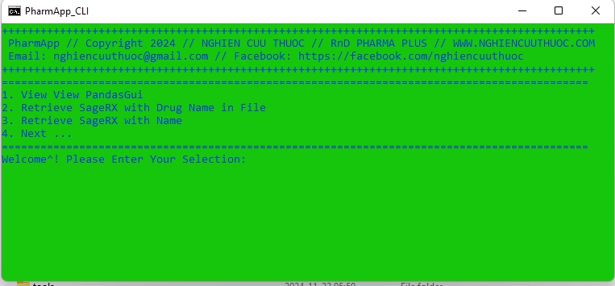
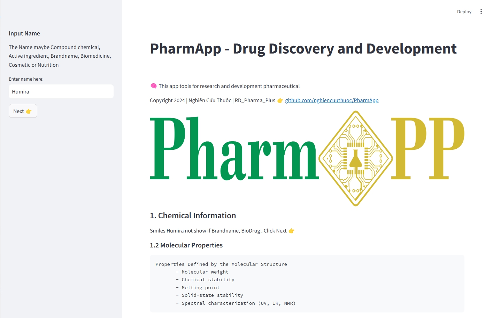

<table align="center">
  <td>
    <a href="https://colab.research.google.com/github/nghiencuuthuoc/PharmApp/PharmApp.ipynb" target="_parent"></a>
  </td>
  <td>
    <a target="_blank" href="https://kaggle.com/kernels/welcome?src=https://github.com/nghiencuuthuoc/PharmApp/blob/master/PharmApp.ipynb"></a>
  </td>
</table>


# PharmApp - Drug Discovery and Development
Copyright 2024 | Nghiên Cứu Thuốc | RD_Pharma_Plus

Email: nghiencuuthuoc@gmail.com | Web: nghiencuuthuoc.com | FB: facebook.com/nghiencuuthuoc 

LinkedIn: linkedin.com/in/nghiencuuthuoc | Zalo: +84888999311 | WhatsAapp: +84888999311

Twitter: x.com/nghiencuuthuoc | YT: youtube.com/@nghiencuuthuoc 


**PharmApp** are tools for research and development pharmaceuticals


## Table of Contents
- [Installation](#installation)
- [How Use](#How-Use)
- [Releases](#Releases)
- [Notebook](#Notebook)
- [Video](#Video)
- [License](#License)


## Installation

You can install for `PharmApp` using use pip:

```bash
git clone https://github.com/nghiencuuthuoc/PharmApp
cd install
pip install -r requirements.txt
```

#### Setup dev environment conda

```shell
conda env create -n pharmapp python==3.12
git clone https://github.com/nghiencuuthuoc/PharmApp
cd install
pip install -r requirements.txt
```
It's recommended to create a virtual environment:

```bash
python3 -m venv Python312
source Python312/bin/activate  # Mac/Linux
Python312\Scripts\activate  # Windows
```

## How Use
### 1. Run Command line: Run file ```PharmApp_CLI.bat```



### 2. Run Web: Run file ```PharmApp_Web.bat```



### 3. Run create shoortcut:
* Send to file to desktop
* edit file to short name (Windows Shortcut)
* Copy to ``` C:\Windows\ ```
* Run with keyboard ``` Windows + R ```, enter ``` Windows Shortcut``` to run
* Run code in ```.\scripts\```
* Top file run ``` python .\scripts\file_name.py ```  here:


| Description | Windows Shortcut | File |
| ----------- | ----------- | ----------- |
| 1. PharmApp Web | form1 | iig_iigs_to_formula_1_st |
| 2. Retrieve SageRX with Drug Name in File | iigsf | iigs_input_file |
| 3. Retrieve SageRX with Name | iigs1 |  iigs |
| 4. Retrieve SageRX View PandasGui | iigs | iig_sagerx |
| 5. Run Test | iigt | scripts\test.bat |
| 6. Run Notebook | iigti | notebook\test.ipynb |
| 7. Retrieve IIG from DailyMed and SageRX | iigva | iig_view_all |
| 8. Retrieve IIG DailyMed Multi Name | iigm | iig_view_multi_pandasgui |
| 9. IIG DailyMed to Formulation | iig2f | iig2formula |
| 10. Retrieve IIG DailyMed with Drug Name in iig_daily.txt  | iigdt |  iig_daily.txt |
| 11. Retrieve IIG DailyMed  with Drug Name in File | iigf | iig_input_file_name.bat |
| 12. View IIG DailyMed View Dtale | iignt | view_iig_dt | 
| 13. View IIG DailyMed Inactive Column | iigni | view_col_inactive |
| 14. View IIG DailyMed and Web NDC | iignn | view_iig_ndc |
| 15. View View PandasGui | iign | view_iig_pdg |

### 4. Run Jupyter notebook: run file ```PharmApp_Notebook.bat```


## Releases
[Download release build run portable](https://github.com/nghiencuuthuoc/PharmApp/releases)
> ***A lot of file can't upload, will upload in release
## Notebook
- [Drugs@FDA_Data_Files](https://github.com/nghiencuuthuoc/PharmApp/blob/master/notebook/Drugs%40FDA_Data_Files.ipynb)
- [Inactive Ingredients Database](https://github.com/nghiencuuthuoc/PharmApp/blob/master/notebook/Inactive%20Ingredients%20Database.ipynb)
- [MongoDB_PyMongo](https://github.com/nghiencuuthuoc/PharmApp/blob/master/notebook/MongoDB_PyMongo.ipynb)
- [Monoclonal_antibodies_Adalimumab](https://github.com/nghiencuuthuoc/PharmApp/blob/master/notebook/Monoclonal_antibodies_Adalimumab.ipynb)
- [Pharmacokinetics](https://github.com/nghiencuuthuoc/PharmApp/blob/master/notebook/Pharmacokinetics.ipynb)
- [Physicochemical_Properties_Drug](https://github.com/nghiencuuthuoc/PharmApp/blob/master/notebook/Physicochemical_Properties_Drug.ipynb)
- [PubChem_DrugBank_ChEMBL](https://github.com/nghiencuuthuoc/PharmApp/blob/master/notebook/PubChem_DrugBank_ChEMBL.ipynb)
- [View table sagerx](https://github.com/nghiencuuthuoc/PharmApp/blob/master/notebook/View%20table%20sagerx.ipynb)
- [drug_name_len](https://github.com/nghiencuuthuoc/PharmApp/blob/master/notebook/drug_name_len.ipynb)
- [extract_database_sagerx_server](https://github.com/nghiencuuthuoc/PharmApp/blob/master/notebook/extract_database_sagerx_server.ipynb)
- [hasaki_crawler](https://github.com/nghiencuuthuoc/PharmApp/blob/master/notebook/hasaki_crawler.ipynb)
- [hsk_80sp](https://github.com/nghiencuuthuoc/PharmApp/blob/master/notebook/hsk_80sp.ipynb)
- [hsk_data_v2_20241016](https://github.com/nghiencuuthuoc/PharmApp/blob/master/notebook/hsk_data_v2_20241016.ipynb)
- [hsk_full](https://github.com/nghiencuuthuoc/PharmApp/blob/master/notebook/hsk_full.ipynb)
- [iig2formula](https://github.com/nghiencuuthuoc/PharmApp/blob/master/notebook/iig2formula.ipynb)
- [iig_iigs_to_formula](https://github.com/nghiencuuthuoc/PharmApp/blob/master/notebook/iig_iigs_to_formula.ipynb)
- [iig_input_file_name](https://github.com/nghiencuuthuoc/PharmApp/blob/master/notebook/iig_input_file_name.ipynb)
- [iigs_multi](https://github.com/nghiencuuthuoc/PharmApp/blob/master/notebook/iigs_multi.ipynb)
- [ndc_analytic_data](https://github.com/nghiencuuthuoc/PharmApp/blob/master/notebook/ndc_analytic_data.ipynb)
- [pharmappiig018dev](https://github.com/nghiencuuthuoc/PharmApp/blob/master/notebook/pharmappiig018dev.ipynb)
- [products_to_inactive_ingredients](https://github.com/nghiencuuthuoc/PharmApp/blob/master/notebook/products_to_inactive_ingredients.ipynb)
- [pyfiglet_PharmApp](https://github.com/nghiencuuthuoc/PharmApp/blob/master/notebook/pyfiglet_PharmApp.ipynb)
- [rdkit_2024_quickstart](https://github.com/nghiencuuthuoc/PharmApp/blob/master/notebook/rdkit_2024_quickstart.ipynb)

## [Website](http://www.nghiencuuthuoc.com/search/label/PharmApp)

## [More Apps](http://www.nghiencuuthuoc.com/search/label/Phan-mem)

## Video
[View more videos on YouTube](https://www.youtube.com/@nghiencuuthuoc)

## License

Under the GPL-2.0-1. See [LICENSE](LICENSE).


